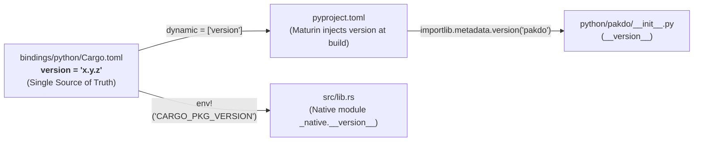
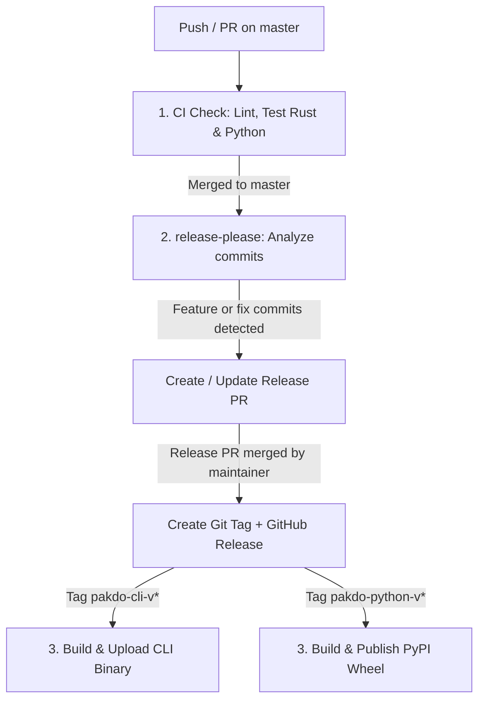

# CI/CD Strategy & Version Management — `pakdo` Monorepo

This document describes the monorepo architecture, the independent versioning strategy, commit conventions, and the automated release cycle via CI/CD.

---

## Table of Contents

1. [Monorepo Structure](#1-monorepo-structure)
2. [Independent Versioning Strategy](#2-independent-versioning-strategy)
   - [Single Sources of Truth](#single-sources-of-truth)
   - [Python Version Chain](#python-version-chain)
3. [Commit Conventions](#3-commit-conventions)
4. [Git Tags & GitHub Releases](#4-git-tags--github-releases)
   - [Tag Format](#tag-format)
   - [Release Artifact Isolation](#release-artifact-isolation)
5. [CI/CD Pipeline](#5-cicd-pipeline)
   - [1. Continuous Integration (`ci.yml`)](#1-continuous-integration-ciyml)
   - [2. Release Automation (`release-plz.yml`)](#2-release-automation-release-plzyml)
   - [3. Artifact Deployment (`release-linux.yml`)](#3-artifact-deployment-release-linuxyml)
6. [Daily Developer Workflow](#6-daily-developer-workflow)

---

## 1. Monorepo Structure

The repository contains the core conversion engine alongside its various consumer interfaces:

```
pakdo/
├── Cargo.toml                  # Root workspace manifest
├── core/                       # Rust crate "pakdo-core" (core conversion engine)
│   └── Cargo.toml
├── apps/
│   └── cli/                    # Rust crate "pakdo-cli" (command-line interface)
│       └── Cargo.toml
├── bindings/
│   └── python/                 # Rust crate & Python package "pakdo" (PyO3 bindings)
│       ├── Cargo.toml          # Single source of truth for Python version
│       ├── pyproject.toml      # Maturin build configuration (dynamic versioning)
│       ├── python/pakdo/       # Pure Python package code + __init__.py
│       └── tests/              # Pytest unit & integration tests
├── docs/                       # Technical documentation
└── .github/workflows/          # GitHub Actions workflows
```

---

## 2. Independent Versioning Strategy

Each component in the monorepo evolves on its own release cycle with its own Semantic Versioning (`MAJOR.MINOR.PATCH`):

- **`pakdo-core`**: Core Rust conversion engine library version.
- **`pakdo-cli`**: Standalone executable binary version distributed to end users.
- **`pakdo-python`**: Python package version distributed via PyPI.

> A bug fix in `pakdo-core` (e.g. `0.1.0` $\rightarrow$ `0.1.1`) does not require an immediate version bump for other packages unless a release of those packages is actually needed.

### Single Sources of Truth

To prevent version discrepancies, each component defines its version in **exactly one file**:

| Component | Source of Truth File |
|---|---|
| `pakdo-core` | `core/Cargo.toml` (`[package] version = "..."`) |
| `pakdo-cli` | `apps/cli/Cargo.toml` (`[package] version = "..."`) |
| `pakdo-python` (Rust & Python) | `bindings/python/Cargo.toml` (`[package] version = "..."`) |

### Python Version Chain

To eliminate manual synchronization across `Cargo.toml`, `pyproject.toml`, and `__init__.py`, the Python package dynamically inherits its version directly from `bindings/python/Cargo.toml`:



---

## 3. Commit Conventions

The monorepo strictly follows the [Conventional Commits](https://www.conventionalcommits.org/) specification. These messages enable automated tooling (`release-please`) to compute SemVer version bumps and generate accurate changelogs.

### Message Format

```
<type>(<scope>): <short description>

[optional body detailing the changes]

[optional footer for breaking changes]
```

### Types and SemVer Impact

| Type | Description | SemVer Impact | Example |
|---|---|---|---|
| `feat` | New feature | **MINOR** (`0.1.0` $\rightarrow$ `0.2.0`) | `feat(core): add webp image support` |
| `fix` | Bug fix | **PATCH** (`0.1.0` $\rightarrow$ `0.1.1`) | `fix(cli): resolve path formatting issue` |
| `perf` | Performance improvement | **PATCH** | `perf(core): optimize buffer allocation` |
| `refactor` | Internal refactoring | None (unless configured) | `refactor(python): simplify error conversion` |
| `docs` / `ci` / `chore` | Docs, CI, maintenance | No bump | `docs: update testing guide` |
| `BREAKING CHANGE` | Breaking API change | **MAJOR** (`0.1.0` $\rightarrow$ `1.0.0`) | `feat(core)!: change convert signature` |

### Recommended Scopes

- `(core)`: Changes to the `pakdo-core` engine.
- `(cli)`: Changes to the `pakdo-cli` application.
- `(python)`: Changes to the `pakdo` Python bindings and package.

---

## 4. Git Tags & GitHub Releases

### Tag Format

In a monorepo with independent versioning, Git tags are prefixed with the package name:

- `pakdo-core-v0.1.0`
- `pakdo-cli-v0.1.0`
- `pakdo-python-v0.1.0`

### Release Artifact Isolation

Each **GitHub Release** is scoped to a specific component:

1. **Artifact Isolation**: Only the artifacts built for the published package are attached to its release:
   - `pakdo-cli-v*` release: Contains compiled binaries (`pakdo-cli-linux-x86_64`, etc.).
   - `pakdo-python-v*` release: Contains PyPI release metadata and binary wheels.
   - `pakdo-core-v*` release: Contains library release notes and changelog entries.
2. **Simplified User Navigation**: Users can filter releases directly on GitHub by searching for the component prefix (e.g. `https://github.com/Game-K-Hack/pakdo/releases?q=pakdo-cli`).

---

## 5. CI/CD Pipeline

The Continuous Integration and Delivery workflow is automated via GitHub Actions:



### 1. Continuous Integration (`ci.yml`)

Runs on every `pull_request` and `push`:
- Formatting verification (`cargo fmt --check`).
- Static analysis (`cargo clippy -D warnings`).
- Rust unit and integration tests (`cargo test --workspace`).
- Python unit tests (`pytest tests -v` via `uv`).

### 2. Release Automation (`release-please.yml`)

Runs on push to `master`:
1. **Release PR Creation**:
   - Scans commits touching `core/`, `apps/cli/`, and `bindings/python/`.
   - Calculates the appropriate SemVer bump.
   - Updates `Cargo.toml` versions and `CHANGELOG.md` files for affected packages.
   - Opens (or updates) a single combined Release Pull Request.
2. **Release Execution** (after merging the Release PR):
   - Generates the corresponding Git tags (`<package>-v<version>`).
   - Publishes GitHub Releases with release notes extracted from the changelog.

### 3. Artifact Deployment (`release-linux.yml`)

Triggered on GitHub Release publication, filtered strictly by tag prefix:

```yaml
jobs:
  build-cli:
    # Only triggered for CLI releases
    if: startsWith(github.event.release.tag_name, 'pakdo-cli-')
    steps:
      - name: Build release binary
        run: cargo build --release --package pakdo-cli
      - name: Upload to GitHub Release
        uses: softprops/action-gh-release@v2
        with:
          files: pakdo-cli-linux-x86_64
```

---

## 6. Daily Developer Workflow

Standard development process for contributing new features or fixes:

1. **Create a working branch:**
   ```bash
   git checkout -b feat/add-webp-support
   ```

2. **Develop and run local tests:**
   ```bash
   cargo test --workspace
   cd bindings/python && uv run pytest tests -v
   ```

3. **Commit using Conventional Commits:**
   ```bash
   git commit -m "feat(core): add webp format conversion support"
   ```

4. **Open a PR and validate with CI:**
   The `ci.yml` workflow automatically runs tests and linters.

5. **Merge to `master`:**
   Once merged, `release-please` detects the `feat(core)` commit and opens a **Release PR** updating `pakdo-core`'s version and `CHANGELOG.md`.

6. **Publish:**
   When ready to release, simply merge the Release PR. Git tags and GitHub Releases are created automatically, triggering artifact compilation and deployment.
